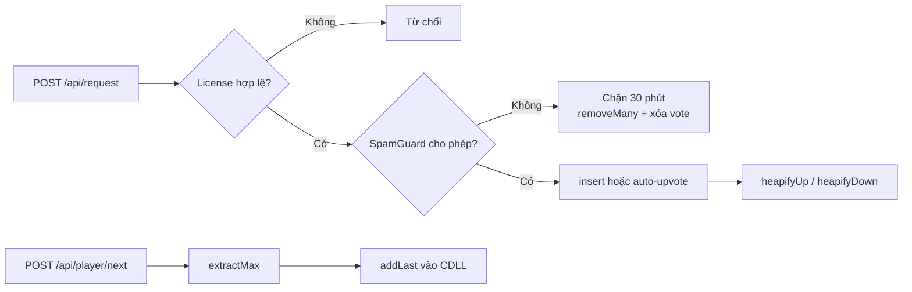

# HeapBeat Backend C11

Đây là backend HTTP viết bằng C thật dành cho phần trình bày cấu trúc dữ liệu và giải thuật của HeapBeat. Mọi lệnh thêm bài, upvote/downvote, chuyển bài và chống spam đều được xử lý trong tiến trình C; giao diện chỉ cần gọi REST API và hiển thị snapshot JSON trả về.

## Các khối thuật toán chính

| Khối | Tệp nguồn | Vai trò | Độ phức tạp chính |
|---|---|---|---|
| Max-Heap + Map chỉ số | `src/heap.c` | Xếp bài theo điểm; tìm request nhanh; `heapifyUp/heapifyDown` sau vote | xem gốc O(1), vote O(log n), `extractMax` O(log n) |
| Circular Doubly Linked List | `src/playlist.c` | Lưu lịch sử phát; Next/Previous; Repeat All | Next/Previous O(1), thêm cuối O(1) |
| Hash Map SpamGuard | `src/spam_guard.c` | Theo dõi StudentID, cửa sổ 10 phút, chặn 30 phút và danh sách request cần thu hồi | trung bình O(1) mỗi tra cứu |
| Service nghiệp vụ | `src/backend.c` | Ghép License Gate, SpamGuard, Heap và playlist thành luồng nhất quán | phụ thuộc thao tác Heap |
| HTTP router | `src/http_server.c` | Nhận REST command và trả JSON/CORS | event loop tuần tự |

Mã đã được chia bằng các banner comment lớn ngay trong từng tệp để có thể mở thẳng khi thuyết trình: **cấu trúc dữ liệu**, **luồng Max-Heap**, **upvote/downvote**, **danh sách liên kết đôi vòng**, **Hash Map chống spam**, **request song**, **player next** và **HTTP router**.

## Luồng request, vote và phát bài



Khi vote thay đổi từ `previousVote` sang `nextVote`, chương trình tính:

```text
delta = nextVote - previousVote
delta > 0  -> độ ưu tiên tăng -> heapifyUp
delta < 0  -> độ ưu tiên giảm -> heapifyDown
```

Do đó chuyển từ downvote `-1` sang upvote `+1` có `delta = +2`, còn chiều ngược lại có `delta = -2`. Mỗi lần đổi chỗ hai node Heap, Hash Map `requestId -> heapIndex` cũng được cập nhật.

## Build và kiểm thử

Yêu cầu: trình biên dịch C11 (`clang` hoặc `gcc`) và `make`.

```bash
cd backend-c
make
make test
```

Chạy server với dữ liệu minh họa:

```bash
./build/heapbeat-backend --port 8081
```

Chạy với catalog rỗng hàng đợi/playlist (catalog bài hát vẫn có):

```bash
./build/heapbeat-backend --port 8081 --empty
```

Có thể build bằng CMake:

```bash
cmake -S . -B build-cmake
cmake --build build-cmake
ctest --test-dir build-cmake --output-on-failure
```

## REST API

| Method | Endpoint | Body / kết quả |
|---|---|---|
| `GET` | `/health` | Trạng thái backend C11 |
| `GET` | `/api/catalog` | Danh mục bài đủ điều kiện |
| `GET` | `/api/queue` | Hàng đợi đã xếp hạng và cờ kiểm tra Heap |
| `GET` | `/api/player` | Bài hiện tại và lịch sử CDLL |
| `GET` | `/api/state` | Queue + player trong một snapshot |
| `POST` | `/api/request` | `{"studentId":"SV001","songId":1}` |
| `POST` | `/api/vote` | `{"studentId":"SV002","requestId":2000,"vote":1}`; vote là `-1`, `0`, `1` |
| `POST` | `/api/queue/remove` | Xóa một request theo `requestId` |
| `POST` | `/api/queue/clear` | Xóa toàn bộ hàng đợi |
| `POST` | `/api/queue/shuffle` | Gán thứ tự phụ và dựng lại Heap |
| `POST` | `/api/player/next` | `extractMax`, thêm cuối CDLL và phát |
| `POST` | `/api/player/previous` | Đi theo con trỏ `prev` |
| `POST` | `/api/reset` | Khôi phục dữ liệu demo |

Website gọi các endpoint này qua `public/api.php`. PHP chỉ reverse-proxy tới
`127.0.0.1:8081`; không giữ bản sao queue và không chạy lại binary theo từng
request. Khi dùng `npm run dev`, Vite chuyển cùng contract API trực tiếp tới C.

Ví dụ trình diễn nhanh:

```bash
curl http://127.0.0.1:8081/health
curl http://127.0.0.1:8081/api/queue
curl -X POST http://127.0.0.1:8081/api/vote \
  -H 'Content-Type: application/json' \
  -d '{"studentId":"SV900","requestId":1003,"vote":1}'
curl -X POST http://127.0.0.1:8081/api/player/next
curl http://127.0.0.1:8081/api/state
```

## Quy tắc chống spam

- Mỗi StudentID được gửi tối đa 3 yêu cầu trong cửa sổ trượt 10 phút.
- Gửi cùng một bài nhiều lần trong cửa sổ này được xem là trùng lặp.
- Lần vi phạm sẽ chặn StudentID trong 30 phút.
- Backend thu hồi toàn bộ request đang sở hữu khỏi Max-Heap và xóa vote của StudentID khỏi những bài còn lại, sau đó dựng lại Heap.
- `ADMIN` được miễn kiểm tra request để phục vụ thao tác quản trị; vote vẫn đi qua API chuẩn.

## Phạm vi của bản trình diễn

Backend dùng bộ nhớ trong và giới hạn kích thước cố định để mã cấu trúc dữ liệu dễ đọc, có thể biên dịch độc lập trong buổi bảo vệ. HTTP server chạy tuần tự, vì vậy một command hoàn tất trước command kế tiếp và không phát sinh data race trong bản demo. Khi triển khai lâu dài, nên bổ sung lưu trữ SQLite/PostgreSQL, xác thực phiên, JSON parser đầy đủ, TLS/reverse proxy và WebSocket/SSE cho cập nhật thời gian thực.
