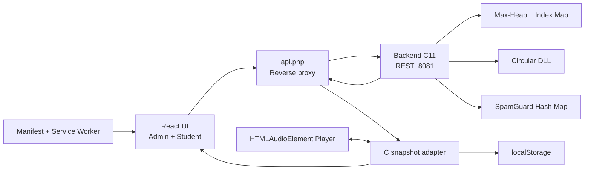
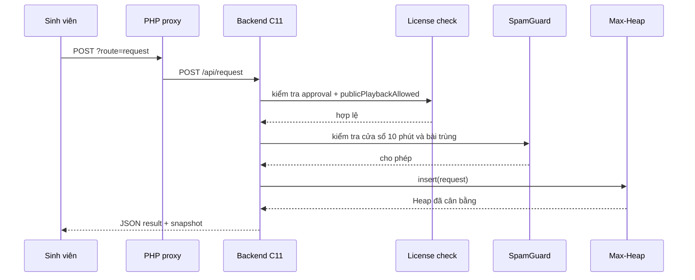

# 03 - Kiến trúc web và PWA

## Quyết định kiến trúc

HeapBeat được triển khai dưới dạng web/PWA bằng React, TypeScript và Vite. Đây
là lựa chọn phù hợp với tình huống sử dụng của đồ án: máy phát nhạc có thể là
laptop trong phòng, còn sinh viên truy cập bằng điện thoại mà không phải cài một
bộ ứng dụng riêng.

Stack của phiên bản nộp:

- React 19 và TypeScript cho giao diện, state và kiểm tra kiểu.
- Vite cho môi trường phát triển và production build.
- HTML5 Audio cho 18 file piano MP3 cục bộ.
- `localStorage` chỉ cho tài khoản demo và tùy chọn giao diện cục bộ.
- PHP reverse proxy chuyển JSON tới backend C11 trên NAS.
- Backend C11 là nguồn sự thật cho queue, vote, playlist và chống spam.
- Web App Manifest và service worker để cài dưới dạng PWA.

## Mô hình thành phần



Ba CTDL chạy thật nằm trong `backend-c/src/`. Bản TypeScript tại
`src/lib/heapbeat.ts` được giữ để đối chiếu, kiểm thử và xếp hạng hiển thị;
frontend không dùng nó để ghi trạng thái queue lên server.

## Ranh giới module

```text
src/
├── app/model.ts
├── audio/useAudioPlayer.ts
├── components/
│   ├── catalog.tsx
│   ├── modals.tsx
│   ├── playback.tsx
│   ├── primitives.tsx
│   └── sidebar.tsx
├── data/catalog.ts
├── lib/heapbeat.ts
└── App.tsx
```

### `lib/heapbeat.ts`

Chứa `QueueMaxHeap`, `CircularDoublyLinkedList` và `SpamGuard`. Module này được
unit test trực tiếp, không cần DOM.

### `app/model.ts`

Chứa kiểu dữ liệu của phòng, action, persistence và reducer. Đây là nơi chuyển
một thao tác người dùng thành cập nhật nhất quán cho Heap, playlist, spam state
và audit log.

### `audio/useAudioPlayer.ts`

Quản lý một `HTMLAudioElement`, volume, seek, sự kiện `timeupdate`, `ended` và
lỗi tải file. Trình phát chỉ hoạt động ở tài khoản Admin để tránh nhiều thiết bị
cùng phát ra loa; thiết bị sinh viên chỉ theo dõi playhead được đồng bộ.

### `components/`

Các component được chia theo nhiệm vụ thay vì dồn trong `App.tsx`: catalog,
player/queue, sidebar, modal quản trị và nhóm primitive dùng lại.

### `App.tsx`

Điều phối đăng nhập, timer, gọi C API, nhận snapshot và ghép các vùng giao diện.
File này không tự cài đặt thao tác Heap/CDLL/SpamGuard của backend.

## Luồng gửi yêu cầu



Nếu License check thất bại, request bị từ chối. Nếu SpamGuard phát hiện vi phạm,
tài khoản bị block và `removeMany` xóa các request đang sở hữu khỏi Heap.

## Luồng vote

1. Frontend gửi `studentId`, `requestId` và vote tới C.
2. `hb_heap_change_vote` cập nhật upvote/downvote và score.
3. Heap chọn `heapifyUp` hoặc `heapifyDown`.
4. `indexByRequestId` được cập nhật sau mỗi lần swap.
5. React render lại thứ hạng và Heap Root.

## Luồng phát

1. Admin bấm Next hoặc bài hiện tại kết thúc.
2. Backend C gọi `extractMax` nếu hàng đợi còn phần tử.
3. Bài lấy từ Heap được thêm vào cuối Circular DLL.
4. Con trỏ playlist chuyển tới bài vừa thêm.
5. HTMLAudioElement phát file MP3 cục bộ và cập nhật tiến độ.
6. Khi Heap trống, Next/Prev tiếp tục đi trên vòng playlist.

## Đồng bộ

Mọi tab đọc `GET api.php?route=state`. PHP chuyển request đến
`GET /api/state` của C; snapshot trả về chứa Max-Heap và CDLL đã được kiểm tra
bất biến. Không còn `state.json`, revision token hoặc field patch.

## PWA và đa nền tảng

`manifest.webmanifest` cho phép cài HeapBeat ở chế độ standalone. Service worker
cache app shell và các tài nguyên tĩnh sau lần tải đầu, nhưng cố ý không cache
`api.php` để tránh trả trạng thái phòng cũ.

Một source web chạy trên:

- Windows, macOS và Linux bằng Chrome, Edge, Firefox hoặc Safari phù hợp.
- Android bằng Chrome/Edge.
- iOS/iPadOS bằng Safari và chức năng Add to Home Screen.

Chính sách autoplay khác nhau giữa trình duyệt, vì vậy Admin vẫn cần một thao
tác người dùng trước khi file âm thanh bắt đầu phát.

## Giới hạn hiện tại

- Xác thực và mật khẩu chỉ phục vụ demo phía client.
- Backend C đang lưu state trong RAM; cần persistence nếu muốn khôi phục sau restart.
- Tài khoản demo trong `localStorage` chưa thay thế SSO/RBAC production.
- Listener count dựa trên heartbeat của tab, không phải số người dùng đã xác
  thực.
- Service worker hỗ trợ app shell, không làm backend LAN hoạt động khi mất mạng.

## Hướng triển khai thật

- Chuyển state dùng chung sang PostgreSQL/Redis.
- Dùng WebSocket cho queue, vote và playhead.
- Tích hợp SSO trường và phân quyền server-side.
- Chỉ import nội dung đã được duyệt license.
- Bổ sung HTTPS, audit bất biến, rate limit theo IP/device và kiểm thử tải.
