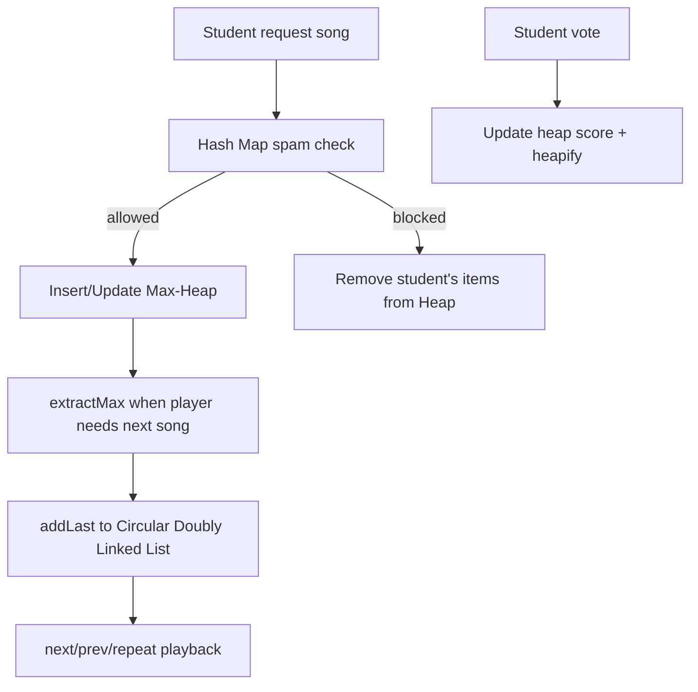

# 04 - Thiết kế cấu trúc dữ liệu

## Tổng quan

HeapBeat cần 3 cấu trúc dữ liệu chính:

- Circular Doubly Linked List cho playlist đã phát/đã duyệt.
- Max-Heap cho hàng đợi bài đang chờ.
- Hash Map cho chống spam, duplicate request và block.

Điểm nên nhấn mạnh trong báo cáo: mỗi CTDL có vai trò riêng, không dùng lẫn. Heap chọn bài kế tiếp theo vote; linked list phục vụ điều hướng phát nhạc; hash map giúp kiểm tra spam O(1) trung bình.

## Kiểu dữ liệu lõi

```ts
type SongId = string;
type RequestId = string;
type StudentHash = string;

type Song = {
  id: SongId;
  canonicalKey: string;
  title: string;
  artist: string;
  durationSec: number;
  audioUrl: string;
  licenseType: string;
  attributionText: string;
};

type QueueItem = {
  requestId: RequestId;
  song: Song;
  requestedBy: StudentHash;
  requestedAt: number;
  upvotes: number;
  downvotes: number;
  score: number;
};
```

`score = upvotes - downvotes`. Có thể mở rộng:

```text
priority = score * 1000000 - waitingPenaltyTieBreaker
```

Nhưng MVP nên giữ đơn giản: vote cao hơn trước, request sớm hơn trước.

## Circular Doubly Linked List

### Mục đích

Quản lý playlist vòng để:

- `next()` luôn có bài kế tiếp nếu list không rỗng.
- `prev()` quay lại bài trước.
- Repeat All tự nhiên vì node cuối nối về head và head nối về node cuối.
- Thêm bài mới vào cuối danh sách O(1).

### Node

```ts
type PlaylistNode = {
  song: Song;
  prev: PlaylistNode;
  next: PlaylistNode;
};
```

### State

```ts
class CircularPlaylist {
  private head: PlaylistNode | null = null;
  private current: PlaylistNode | null = null;
  private length = 0;
}
```

### Invariant

- Nếu list rỗng: `head = null`, `current = null`, `length = 0`.
- Nếu list có 1 node: `node.next = node`, `node.prev = node`.
- Nếu list có nhiều node: `head.prev` là tail, `tail.next` là head.
- `current` luôn là một node trong list.

### Pseudocode addLast

```text
addLast(song):
  node = new Node(song)
  if head == null:
    node.next = node
    node.prev = node
    head = node
    current = node
  else:
    tail = head.prev
    tail.next = node
    node.prev = tail
    node.next = head
    head.prev = node
  length++
```

### Pseudocode next/prev

```text
next():
  if current == null: return null
  current = current.next
  return current.song

prev():
  if current == null: return null
  current = current.prev
  return current.song
```

## Max-Heap

### Mục đích

Quản lý bài đang chờ theo điểm vote. Phần tử có độ ưu tiên cao nhất luôn ở index `0`, nên lấy bài kế tiếp là O(log n) với `extractMax`.

### State

```ts
class QueueMaxHeap {
  private heap: QueueItem[] = [];
  private indexByRequestId = new Map<RequestId, number>();
  private requestBySongKey = new Map<string, RequestId>();
}
```

`indexByRequestId` rất quan trọng. Không có map này, khi vote một bài bất kỳ ta phải quét mảng O(n). Có map, cập nhật vote là O(log n).

### Comparator

```text
higherPriority(a, b):
  if a.score != b.score:
    return a.score > b.score
  return a.requestedAt < b.requestedAt
```

### Pseudocode insert

```text
insert(item):
  heap.push(item)
  indexByRequestId[item.requestId] = heap.length - 1
  heapifyUp(heap.length - 1)
```

### Pseudocode updateVote

```text
updateVote(requestId, delta):
  i = indexByRequestId[requestId]
  oldScore = heap[i].score
  heap[i].score += delta
  if heap[i].score > oldScore:
    heapifyUp(i)
  else:
    heapifyDown(i)
```

### Pseudocode extractMax

```text
extractMax():
  if heap is empty: return null
  max = heap[0]
  last = heap.pop()
  remove indexByRequestId[max.requestId]
  if heap not empty:
    heap[0] = last
    indexByRequestId[last.requestId] = 0
    heapifyDown(0)
  return max
```

### Xóa bài bất kỳ khỏi heap

Chống spam yêu cầu xóa toàn bộ bài của sinh viên bị block, nên heap cần `remove(requestId)`:

```text
remove(requestId):
  i = indexByRequestId[requestId]
  last = heap.pop()
  remove indexByRequestId[requestId]
  if i == heap.length: return
  heap[i] = last
  indexByRequestId[last.requestId] = i
  heapifyUp(i)
  heapifyDown(current index of last)
```

## Hash Map chống spam

### Mục đích

Kiểm tra nhanh:

- Sinh viên có đang bị block không?
- Trong 10 phút gần nhất đã gửi bao nhiêu request?
- Đã gửi bài này chưa?
- Khi block, cần xóa những request nào khỏi heap?

### State

```ts
type StudentSpamState = {
  requestTimestamps: number[];
  requestedSongKeys: Set<string>;
  activeRequestIds: Set<RequestId>;
  blockedUntil?: number;
};

class SpamGuard {
  private states = new Map<StudentHash, StudentSpamState>();
}
```

### Quy tắc MVP

```text
MAX_REQUESTS = 3
WINDOW_MS = 10 * 60 * 1000
BLOCK_MS = 30 * 60 * 1000
```

### Pseudocode checkRequest

```text
checkRequest(studentHash, canonicalSongKey, now):
  state = states.getOrCreate(studentHash)

  if state.blockedUntil != null and state.blockedUntil > now:
    return BLOCKED

  remove timestamps older than now - WINDOW_MS

  if canonicalSongKey in state.requestedSongKeys:
    block(studentHash, now)
    return BLOCK_AND_PURGE

  if state.requestTimestamps.length >= MAX_REQUESTS:
    block(studentHash, now)
    return BLOCK_AND_PURGE

  state.requestTimestamps.push(now)
  state.requestedSongKeys.add(canonicalSongKey)
  return ALLOWED
```

### Pseudocode block và purge

```text
block(studentHash, now):
  state.blockedUntil = now + BLOCK_MS
  for requestId in state.activeRequestIds:
    heap.remove(requestId)
  state.activeRequestIds.clear()
```

## Phối hợp 3 CTDL



## Độ phức tạp

| Thao tác | CTDL | Độ phức tạp |
| --- | --- | --- |
| Thêm bài vào playlist | Circular Doubly Linked List | O(1) |
| Next/Prev | Circular Doubly Linked List | O(1) |
| Thêm request vào queue | Max-Heap | O(log n) |
| Lấy bài vote cao nhất | Max-Heap | O(log n) |
| Upvote/Downvote | Max-Heap + index map | O(log n) |
| Tìm request theo ID | Hash Map | O(1) trung bình |
| Kiểm tra spam | Hash Map | O(1) trung bình, cộng số timestamp nhỏ |
| Xóa toàn bộ request của user bị block | Hash Map + Heap | O(k log n), k là số request active của user |

## Test case CTDL nên có

- Linked list rỗng: `next()` trả null.
- Linked list 1 phần tử: `next()` và `prev()` đều trả chính nó.
- Linked list nhiều phần tử: đi qua tail thì quay về head.
- Heap insert nhiều bài: root luôn là bài score cao nhất.
- Heap upvote bài ở giữa: bài đó nổi lên đúng vị trí.
- Heap downvote root: root mới đúng.
- Heap remove request bất kỳ: heap vẫn hợp lệ.
- Spam request thứ 4 trong 10 phút: block 30 phút.
- Spam duplicate song: block và purge tất cả request của sinh viên đó.
