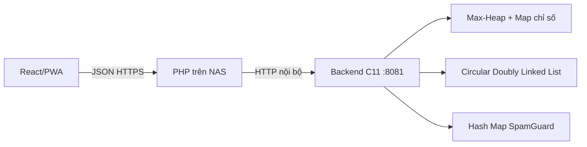

# 05 - API backend và realtime

## Hiện trạng triển khai trong mã nguồn

HeapBeat sử dụng backend C11 làm nguồn sự thật cho luồng hàng đợi và phát bài:

| Thành phần | Vị trí | Trạng thái | Mục đích |
| --- | --- | --- | --- |
| React/PWA | `src/` | Client | Gửi command và render snapshot do C trả về |
| PHP gateway | `public/api.php` | Reverse proxy | Ánh xạ route công khai sang C tại `127.0.0.1:8081` |
| Backend C11 | `backend-c/` | Backend authoritative | Thực thi Max-Heap, CDLL và Hash Map chống spam |

PHP không chạy lại binary bằng `exec()` theo từng request. Tiến trình C chạy lâu
dài để giữ state trong RAM; PHP mở kết nối TCP nội bộ, chuyển request và giữ
nguyên HTTP status/JSON response của C.

### API thực tế của backend C11

Sau khi chạy `backend-c/build/heapbeat-backend`, chương trình lắng nghe mặc
định tại `127.0.0.1:8081` và cung cấp các endpoint sau:

| Method | Endpoint | Thuật toán được thực thi |
| --- | --- | --- |
| `GET` | `/health` | Kiểm tra tiến trình C11 |
| `GET` | `/api/catalog` | Đọc danh mục bài hát minh họa |
| `GET` | `/api/queue` | Trích snapshot Max-Heap theo thứ tự ưu tiên |
| `GET` | `/api/player` | Đọc bài hiện tại và lịch sử CDLL |
| `GET` | `/api/state` | Gộp queue và player thành một snapshot |
| `POST` | `/api/request` | License Gate → SpamGuard → insert/auto-upvote → heapify |
| `POST` | `/api/vote` | Đổi vote `-1/0/+1` → tính delta → heapifyUp/heapifyDown |
| `POST` | `/api/player/next` | `extractMax` → `addLast` vào CDLL → phát bài |
| `POST` | `/api/player/previous` | Di chuyển bằng con trỏ `prev` của CDLL |
| `POST` | `/api/reset` | Khôi phục state minh họa trong bộ nhớ |

Ví dụ kiểm tra độc lập:

```bash
cd backend-c
make
make test
./build/heapbeat-backend --port 8081
```

```bash
curl http://127.0.0.1:8081/api/queue
curl -X POST http://127.0.0.1:8081/api/vote \
  -H 'Content-Type: application/json' \
  -d '{"studentId":"SV900","requestId":1003,"vote":1}'
curl -X POST http://127.0.0.1:8081/api/player/next
```

### Luồng PHP gọi C hiện tại

Phương án phù hợp là giữ backend C chạy lâu dài như một service nội bộ và để
PHP reverse-proxy request qua `127.0.0.1:8081`. Không nên dùng `exec()` để chạy
lại binary C cho từng request PHP, vì mỗi process mới sẽ có một vùng nhớ mới và
làm mất trạng thái Max-Heap, playlist và SpamGuard.



Đây là luồng chạy mặc định của bản nộp. Khi phát triển bằng Vite, dev proxy đi
thẳng tới C nhưng vẫn giữ contract `api.php?route=...` ở mã frontend.

## Nguyên tắc thiết kế

- REST dùng cho lệnh có kết quả rõ ràng: tạo request, vote, skip, duyệt bài.
- WebSocket dùng để broadcast trạng thái realtime: queue, now playing, block.
- Backend là nguồn sự thật cho Max-Heap và Spam Hash Map.
- Player chỉ phát bài đã được backend xác nhận hợp lệ license.

## REST API MVP

### Room

```http
POST /api/rooms
GET /api/rooms/:roomId
POST /api/rooms/:roomId/join
```

Payload tạo phòng:

```json
{
  "name": "Phong tu hoc A1",
  "mode": "demo",
  "allowExplicit": false
}
```

### Catalog

```http
GET /api/catalog/search?q=lofi&provider=internal
POST /api/catalog/import
PATCH /api/catalog/songs/:songId/approval
GET /api/catalog/songs/:songId/license
```

Import bài:

```json
{
  "provider": "openverse",
  "providerSongId": "abc123",
  "title": "Study Loop",
  "artist": "Nguyen A",
  "audioUrl": "https://example.edu/audio/study-loop.mp3",
  "sourceUrl": "https://example.edu/study-loop",
  "licenseType": "CC-BY",
  "licenseUrl": "https://creativecommons.org/licenses/by/4.0/",
  "attributionText": "\"Study Loop\" by Nguyen A, CC BY 4.0"
}
```

### Queue

```http
GET /api/rooms/:roomId/queue
POST /api/rooms/:roomId/requests
DELETE /api/rooms/:roomId/requests/:requestId
POST /api/rooms/:roomId/requests/:requestId/upvote
POST /api/rooms/:roomId/requests/:requestId/downvote
```

Request bài:

```json
{
  "studentId": "SV001",
  "songId": "song_123"
}
```

Response thành công:

```json
{
  "requestId": "req_123",
  "status": "queued",
  "score": 1,
  "heapIndex": 3
}
```

Response bị block:

```json
{
  "error": "SPAM_BLOCKED",
  "message": "Student is blocked for duplicate or excessive requests.",
  "blockedUntil": "2026-07-08T15:30:00.000Z",
  "purgedRequestIds": ["req_100", "req_101"]
}
```

### Player

```http
GET /api/rooms/:roomId/player/current
POST /api/rooms/:roomId/player/play
POST /api/rooms/:roomId/player/pause
POST /api/rooms/:roomId/player/next
POST /api/rooms/:roomId/player/previous
POST /api/rooms/:roomId/player/ended
POST /api/rooms/:roomId/player/skip
```

Khi bài kết thúc, Player gọi:

```json
{
  "endedSongId": "song_123",
  "endedAt": "2026-07-08T15:00:00.000Z"
}
```

Backend trả:

```json
{
  "nextSource": "heap",
  "song": {
    "id": "song_456",
    "title": "Campus Morning",
    "artist": "Tran B",
    "audioUrl": "https://example.edu/audio/campus-morning.mp3",
    "attributionText": "\"Campus Morning\" by Tran B, CC BY-SA 4.0"
  }
}
```

## WebSocket events

Client connect:

```text
wss://server.example.edu/ws/rooms/:roomId
```

### Client -> Server

```json
{
  "type": "queue.subscribe",
  "roomId": "room_a1"
}
```

```json
{
  "type": "presence.ping",
  "studentId": "SV001"
}
```

### Server -> Client

`queue.updated`

```json
{
  "type": "queue.updated",
  "roomId": "room_a1",
  "items": [
    {
      "requestId": "req_1",
      "songId": "song_1",
      "title": "Study Loop",
      "artist": "Nguyen A",
      "score": 12,
      "upvotes": 14,
      "downvotes": 2,
      "rank": 1
    }
  ]
}
```

`nowPlaying.changed`

```json
{
  "type": "nowPlaying.changed",
  "roomId": "room_a1",
  "songId": "song_1",
  "title": "Study Loop",
  "artist": "Nguyen A",
  "startedAt": "2026-07-08T15:05:00.000Z",
  "durationSec": 180,
  "attributionText": "\"Study Loop\" by Nguyen A, CC BY 4.0"
}
```

`spam.blocked`

```json
{
  "type": "spam.blocked",
  "roomId": "room_a1",
  "studentHash": "hmac_abc",
  "reason": "DUPLICATE_SONG_REQUEST",
  "blockedUntil": "2026-07-08T15:35:00.000Z"
}
```

`license.rejected`

```json
{
  "type": "license.rejected",
  "songId": "song_2",
  "reason": "Missing licenseUrl or public playback permission."
}
```

## Mã lỗi

| Code | HTTP | Ý nghĩa |
| --- | --- | --- |
| `ROOM_NOT_FOUND` | 404 | Không tìm thấy phòng. |
| `SONG_NOT_FOUND` | 404 | Không tìm thấy bài. |
| `SONG_NOT_APPROVED` | 409 | Bài chưa được duyệt license. |
| `DUPLICATE_SONG_REQUEST` | 429 | Sinh viên gửi trùng bài. |
| `REQUEST_LIMIT_EXCEEDED` | 429 | Quá 3 request trong 10 phút. |
| `SPAM_BLOCKED` | 403 | Sinh viên đang bị block. |
| `VOTE_ALREADY_EXISTS` | 409 | Vote trùng cùng chiều. |
| `PLAYER_NOT_BOUND` | 409 | Phòng chưa có Player/Kiosk kết nối. |

## Logic vote

Mỗi sinh viên có một vote state cho mỗi request:

```ts
type VoteValue = -1 | 0 | 1;
```

Delta khi cập nhật:

| Vote cũ | Vote mới | Delta score |
| --- | --- | --- |
| 0 | 1 | +1 |
| 0 | -1 | -1 |
| 1 | -1 | -2 |
| -1 | 1 | +2 |
| 1 | 0 | -1 |
| -1 | 0 | +1 |

Sau khi tính delta, gọi `heap.updateVote(requestId, delta)`.

## Tái tạo state sau restart

1. Load `queue_requests` có trạng thái `active`.
2. Tính `score = upvotes - downvotes`.
3. Build heap bằng Floyd heapify O(n).
4. Load `student_rate_limits` còn hạn block.
5. Load `play_history` gần nhất để rebuild Circular Playlist.
6. Broadcast `server.restored`.

## Gợi ý bảo vệ API

- Student request cần `roomCode` hoặc token phòng.
- Admin endpoint cần auth riêng.
- WebSocket phải kiểm tra quyền join room.
- Không gửi StudentID thô qua broadcast.
- API key của provider nhạc phải nằm ở backend.
- Log mọi lần license gate từ chối bài.
